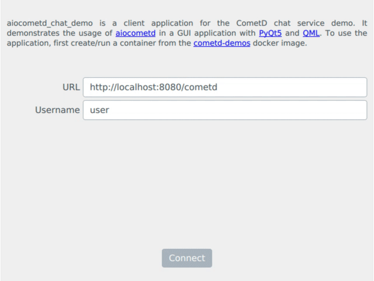

aiocometd-chat-demo
===================

.. image:: https://travis-ci.org/robertmrk/aiocometd-chat-demo.svg
    :target: https://travis-ci.org/robertmrk/aiocometd-chat-demo
    :alt: Build status

.. image:: https://coveralls.io/repos/github/robertmrk/aiocometd-chat-demo/badge.svg
    :target: https://coveralls.io/github/robertmrk/aiocometd-chat-demo
    :alt: Coverage

.. image:: https://img.shields.io/badge/License-MIT-yellow.svg
    :target: https://opensource.org/licenses/MIT
    :alt: MIT license

aiocometd_chat_demo_ is a client application for the CometD_ chat service demo.
It demonstrates the usage of aiocometd_ in a GUI application with PyQt5_ and
QML_.

Requirements
------------

- Python 3.7
- aiocometd_
- PyQt5_
- quamash_

Install
-------

Get the source by downloading the `latest release <releases_>`_,
or clone it from `github <aiocometd_chat_demo_>`_::

    $ git clone https://github.com/robertmrk/aiocometd-chat-demo.git
    $ cd aiocometd-chat-demo

aiocometd-chat-demo requires python 3.7 and `pipenv`_ to be installed.

To install pipenv run::

    $ pip install pipenv

To install aiocometd-chat-demo and all of its dependencies in a virtual
environment run::

    $ pipenv install --ignore-pipfile

then activate the virtual environment and run the application::

    $ pipenv shell
    $ python -m aiocometd_chat_demo

.. _aiocometd_chat_demo: https://github.com/robertmrk/aiocometd-chat-demo
.. _CometD: https://cometd.org/
.. _aiocometd: https://github.com/robertmrk/aiocometd
.. _PyQt5: https://www.riverbankcomputing.com/software/pyqt/intro
.. _QML: http://doc.qt.io/qt-5/qmlapplications.html
.. _quamash: https://github.com/harvimt/quamash
.. _releases: https://github.com/robertmrk/aiocometd-chat-demo/releases
.. _pipenv: https://docs.pipenv.org/
